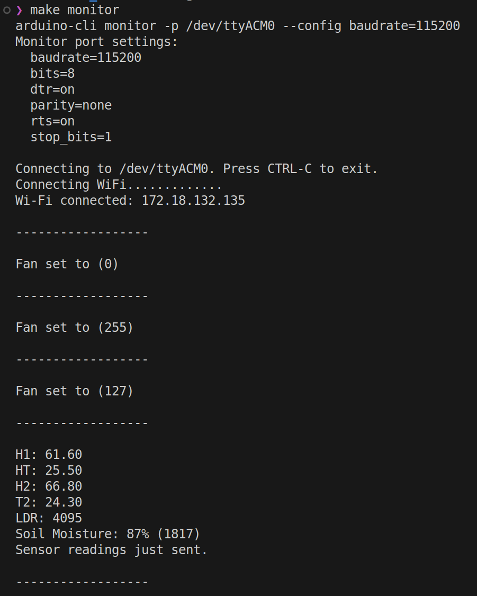

# Controlled Environment
Small environment monitor/controller project. Intended, at the moment, to run on ESP32 chips.

By "environment" I mean an aquarium, a greenhouse, or a room for animals, for example. A closed space in which one might want to `monitor` the air, water, temperature, gases, soil parameters, and/or `control` lights, ventilation, or temperature.


## How does it work?
The microcontroller will collect data from sensors connected to its pins, print them on serial monitor, and send them as a JSON to a API of your choice. Also, it will provide some endpoints on its IP, printed on serial monitor when it connects to WIFI, to control fans and lights.

In other words, it provides a way to see the collected  data directly, to send data to a remote server, and to receive commands from a remote device.




## How to use
After cloning this repo, create a `.env` file, based on `.env.example`, and add your own variables accordingly.


### Install dependencies
Make sure [you have installed](https://docs.arduino.cc/arduino-cli/installation/) `arduino-cli`. Then just run, inside the project's directory:
```
make install
```


### Make your own tweaks
Adjust the PINS and sensor readings as you please at `src/sensors.cpp`. Deal with wifi connection details at `src/wifiConnection.cpp`. Make the changes you find needed for controlling devices with Wi-Fi commands at `src/webcontrollers.cpp` and at `src/controlled.cpp`. And replace whatever is needed about reporting data to a remote server at `src/reportingAPI.cpp`


### Build
Just run:
```
make compile
```

This will basically run `arduino-cli compile`. The results should be the same as you would get compiling on `Arduino IDE`.


### Upload
The command below actually compiles `AND` upload the code to the COM `PORT` you've set at `.env`:
```
make upload
```

You can change that behavior just by updating `Makefile` to whatever you need.


### Serial Monitor
You can access the serial monitor also as you would on `Arduino IDE`, running:
```
make monitor
```


## Why?
### ... does this code not just rely on Arduino IDE?

The idea was to be as free as possible from a specific IDE that may or may not install correctly depending on your operating system. And `arduino-cli` by itself seems to install and work stably enough more widely and easily.

To recreate the entire build process down to `gcc` or something like that would also not be interesting because that is not the focus of the project and would probably take much more effort.

Also, `arduino-cli` provides support for many different boards (FQDN). So it makes the whole process much easier.

And last but not least, this project is partially compatible with Arduino IDE already. You would need to just install the required dependencies listed on `Makefile`'s `install` statement through the IDE's library manager, choose the correct board and COM Port on the IDE selector, and replace the environment variables inside the code by the values hardcoded.

(If you know a way to use the `Makefile`'s instructions inside the Arduino IDE, please let me know).


### ... so many files?

The project is also an object of starting in the C/C++ world. From the very basics, like having custom `Makefile`, `#include`, and header behaviors, and the way the code could be organized with it. References and pointers. So breaking up the code into smaller functions, inside their own context, and foreseeing future maintenance and constant tweaks sounded interesting.


### ... so many things in .env and not just hardcoded?

This code was developed for a real project that is getting increments over time. And during that time many parts of the whole circuit had to change for many reasons. And those sounded like very good candidates to become something that anyone should be able to easily set without having to dig down the code to find where they are being used.